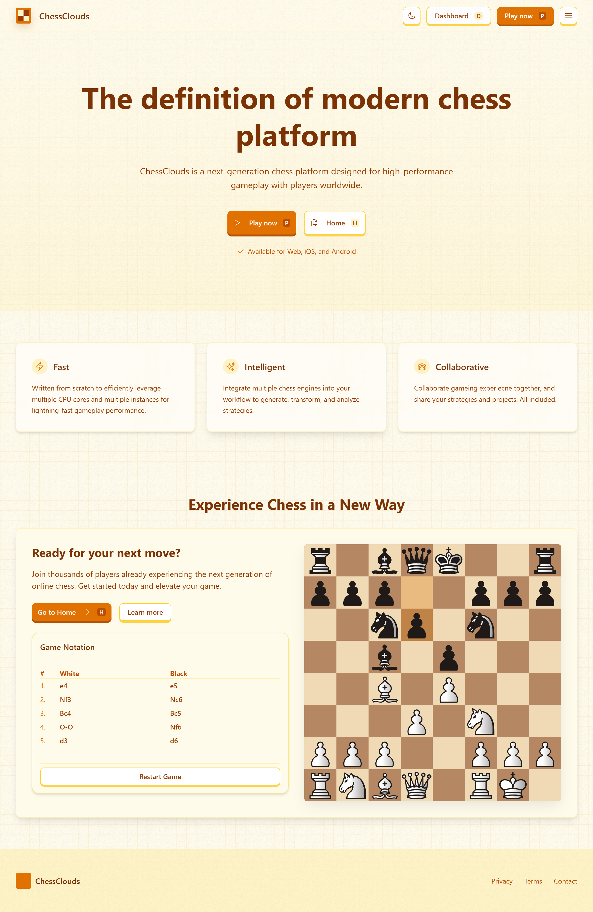
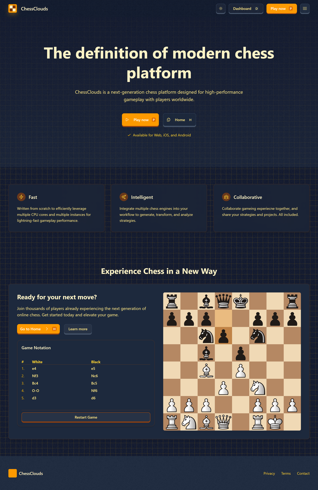
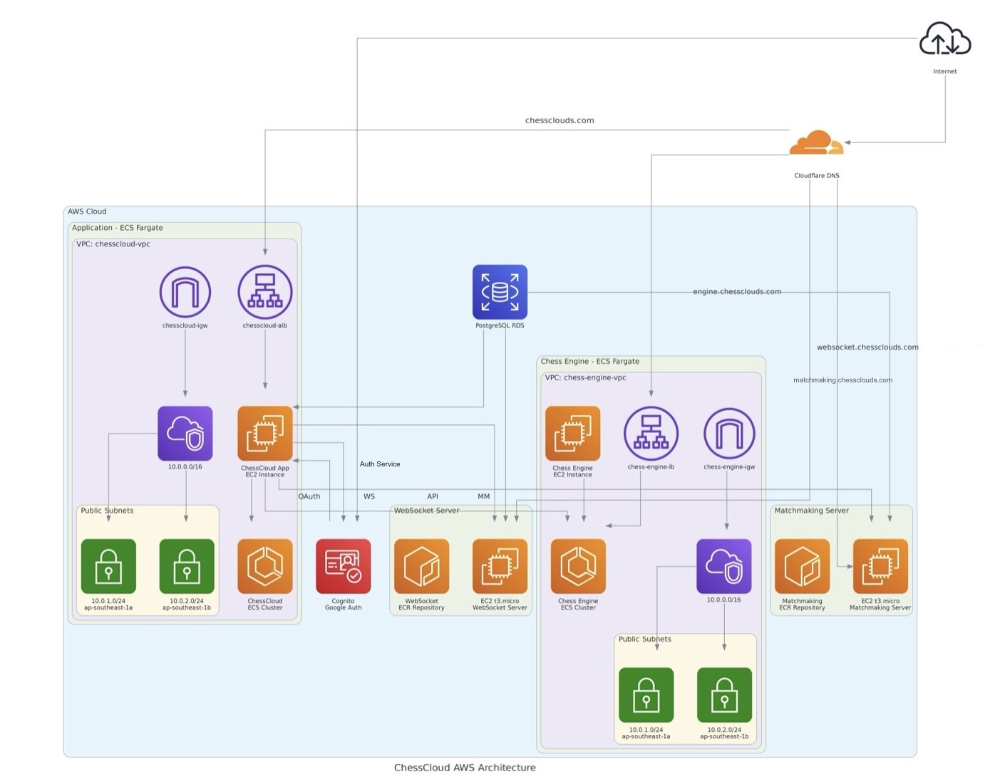

# ChessClouds

<p align="center" style="display: flex; justify-content: center; gap: 20px; margin-bottom: 20px;">
  
  
</p>

ChessClouds is a next-generation chess platform designed for high-performance gameplay with players worldwide. It offers a modern, intuitive interface and powerful backend systems for real-time multiplayer matches and computer opponents.

## Table of Contents

- [Overview](#overview)
- [Features](#features)
- [Architecture](#architecture)
- [Components](#components)
  - [Web Frontend](/web/README.md)
  - [Chess Engine](/engine/README.md)
  - [WebSocket Server](/ws_server/README.md)
  - [Matchmaking Service](/matchmaking/README.md)
- [Development](#development)
- [Terraform](#terraform)
- [License](#license)

## Overview

ChessClouds provides a comprehensive chess gaming experience with both real-time multiplayer and computer opponents. The platform features a beautiful UI with light and dark modes, real-time gameplay, matchmaking, and integration with a powerful chess engine.

<p align="center">
  
</p>

## Features

- **Real-time gameplay** - Play chess matches in real-time with players worldwide
- **Computer opponents** - Challenge the Stockfish chess engine at various difficulty levels
- **Matchmaking** - Automatically find opponents of similar skill level
- **Beautiful UI** - Modern, responsive interface with both light and dark modes
- **Game analysis** - Review past games with move history
- **Authentication** - Secure login with Google authentication
- **Game history** - Track your performance and review past games
- **Responsive design** - Play on any device, from desktop to mobile

<div style="display: flex; justify-content: space-between;">
  
  
</div>

## Architecture

ChessClouds is built with a microservices architecture:

- **Frontend**: Next.js React application
- **Backend Services**:
  - **WebSocket Server**: Real-time game communication
  - **Matchmaking Service**: Player matchmaking
  - **Chess Engine API**: Stockfish integration
- **Database**: PostgreSQL for game state persistence

<p align="center">
  
</p>

## Development

### Prerequisites

- Docker and Docker Compose
- Node.js 18+ and Bun (for web development)
- Rust (for backend services)

### Setup

1. Clone the repository
```bash
git clone https://github.com/yourusername/chessclouds.git
cd chessclouds
```

2. Copy the environment template
```bash
cp template.env .env
```

3. Update the environment variables as needed

4. Start the services with Docker Compose
```bash
docker-compose up -d
```

5. Access the web application at http://localhost:3000

## Terraform

Deploying Matchmaking, Websocket and ChessEngine via Terraform

### Prerequisites

- AWS CLI
- Terraform

### Setup

1. Configure AWS Access Key and Secret Key
```bash
aws configure
AWS Access Key ID [****************AAUB]:
AWS Secret Access Key [****************3adc]:
Default region name [ap-southeast-1]:
Default output format [None]:
```

2. Initialize Terraform
```bash
cd Terraform
terraform init
```

3. Apply Terraform
```bash
terraform apply
```
