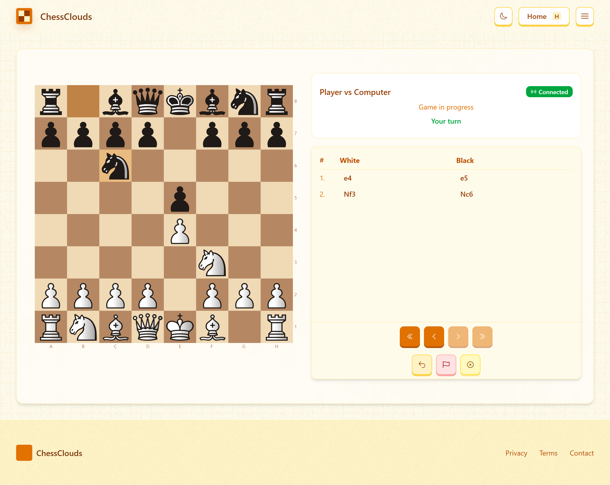

# ChessClouds Chess Engine

<p align="center">
  
</p>

The ChessClouds Chess Engine service provides an HTTP API wrapper around the Stockfish chess engine, enabling computer opponent gameplay and move analysis.

## Features

- **Stockfish Integration** - Interface with the powerful Stockfish chess engine
- **HTTP API** - RESTful endpoints for chess move calculations
- **Best Move Analysis** - Calculate optimal moves for any position
- **Engine Evaluation** - Assess position strength and advantage
- **FEN Support** - Analysis using Forsyth-Edwards Notation for board positions

## Architecture

The Engine service is built as a Rust application using:

- **Hyper** - Fast HTTP implementation
- **Tokio** - Asynchronous runtime
- **Shakmaty** - Chess move validation and board state management
- **Stockfish** - The underlying chess engine executable
- **Socat** - For communication between the API and Stockfish process

## API Endpoints

### GET /

Get status of the engine API.

**Response:**
```json
{
  "message": "Stockfish API is running"
}
```

### GET /test

Test connection to the Stockfish engine.

**Response:**
```json
{
  "status": "success",
  "message": "Connected to Stockfish successfully",
  "response": "uciok"
}
```

### GET /bestmove?fen={FEN}

Get the best move for a given position.

**Parameters:**
- `fen`: Board position in FEN notation

**Response:**
```json
{
  "best_move": "e2e4",
  "new_fen": "rnbqkbnr/pppppppp/8/8/4P3/8/PPPP1PPP/RNBQKBNR b KQkq e3 0 1"
}
```

## Deployment

The chess engine runs in its own Docker container with the following components:

1. **Stockfish** - The chess engine binary
2. **Socat** - Acts as a proxy to communicate with Stockfish
3. **API Server** - The Hyper-based HTTP server
4. **Supervisord** - Process manager to keep both services running

## Setup and Development

### Prerequisites

- Rust 1.65+
- Docker (for containerized deployment)

### Local Development

1. Navigate to the engine directory
```bash
cd engine
```

2. Build the Rust project
```bash
cargo build --release
```

3. Run the API server
```bash
cargo run --release
```

### Docker Deployment

```bash
docker build -t chessclouds-engine .
docker run -p 4000:4000 chessclouds-engine
```

## Communication

The Engine service communicates with the Stockfish process using UCI (Universal Chess Interface) protocol. The API server sends commands to Stockfish and processes the responses to provide a simple HTTP interface for the frontend application.