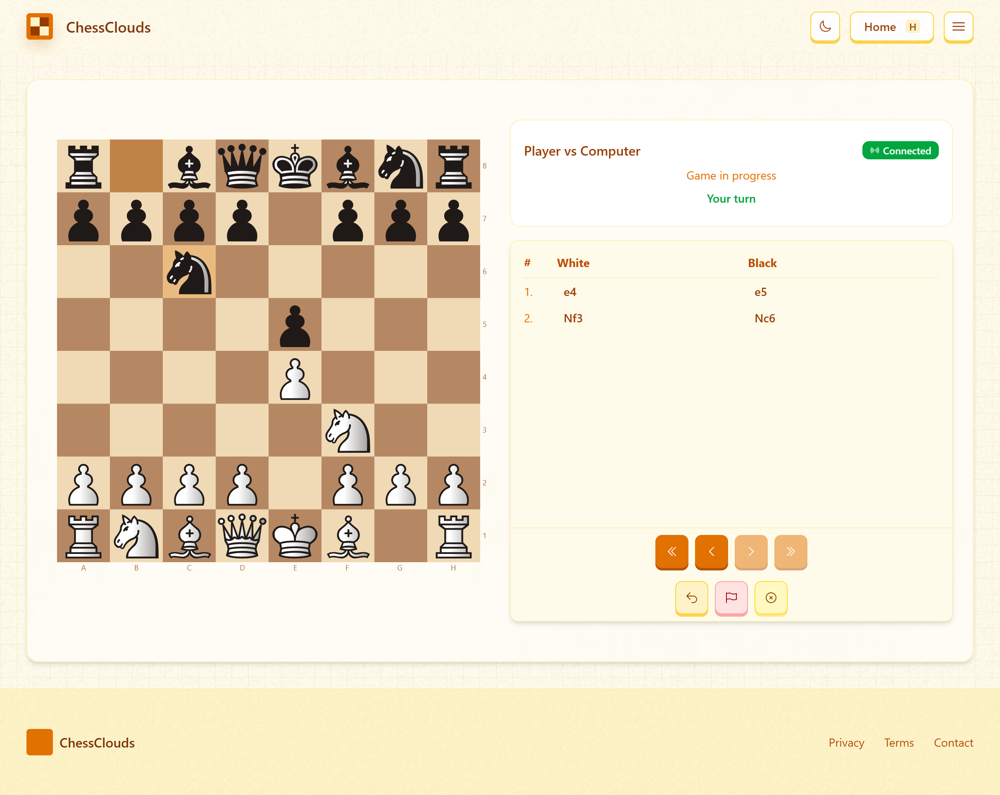

# ChessClouds Web Frontend

<p align="center">
  
</p>

The web frontend for ChessClouds is built with Next.js and React, providing a modern, responsive user interface for playing chess.

## Features

- **Responsive UI** - Beautiful interface that works on desktop and mobile
- **Real-time gameplay** - Play chess with live opponents via WebSockets
- **Computer play** - Challenge the Stockfish engine with different play styles
- **Authentication** - Secure login with Google OAuth
- **Dark/Light mode** - Easy on the eyes in any environment
- **Game history** - Track your progress and review past games
- **Interactive board** - Drag and drop pieces with move suggestions


## Tech Stack

- **Next.js** - React framework with server-side rendering
- **TypeScript** - Static typing for better code quality
- **TailwindCSS** - Utility-first CSS framework
- **Prisma** - Database ORM for PostgreSQL
- **Bun** - JavaScript runtime for development and building

## Project Structure

```
web/
├── prisma/                 # Database schema and migrations
├── src/
│   ├── app/                # Next.js app router pages
│   ├── components/         # React components
│   ├── lib/                # Utility functions and services
│   ├── types/              # TypeScript type definitions
│   └── ...
├── public/                 # Static assets
├── next.config.ts          # Next.js configuration
├── tailwind.config.js      # TailwindCSS configuration
└── ...
```

## Setup and Development

### Prerequisites

- Node.js 18+ or Bun
- PostgreSQL database

### Local Development

1. Install dependencies
```bash
cd web
bun install
```

2. Set up environment variables
```bash
cp .env.example .env.local
```

3. Generate Prisma client
```bash
bunx prisma generate
```

4. Run development server
```bash
bun dev
```

5. Open http://localhost:3000 in your browser

### Building for Production

```bash
bun run build
```

## API Integrations

The web frontend integrates with the following services:

- **WebSocket Server** - Real-time game communication
- **Matchmaking Service** - Finding opponents
- **Chess Engine API** - Computer opponent moves

## Authentication

Authentication is handled via Google OAuth flow:

1. User initiates login
2. Redirected to Google authentication
3. Google redirects back with JWT token
4. Token is validated and user session established